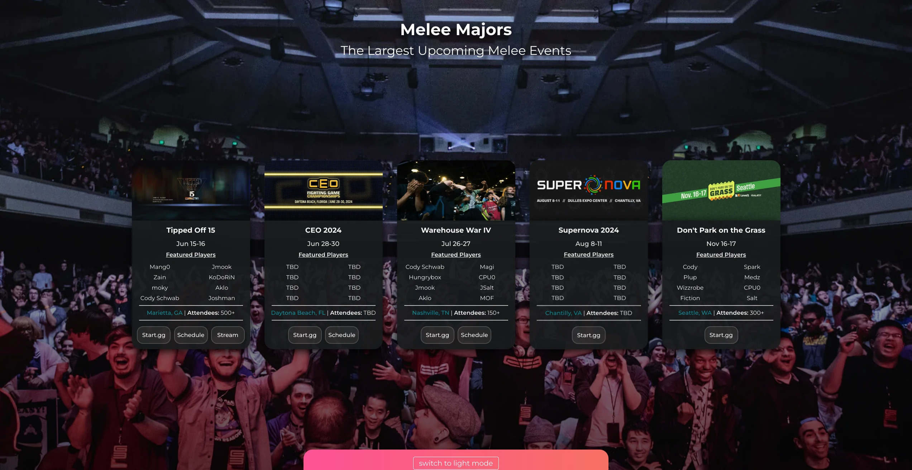
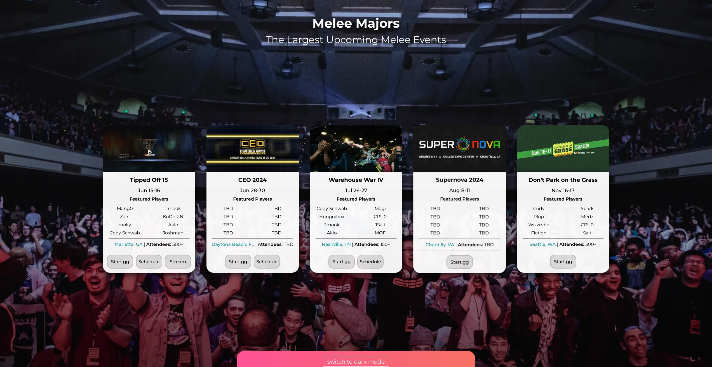
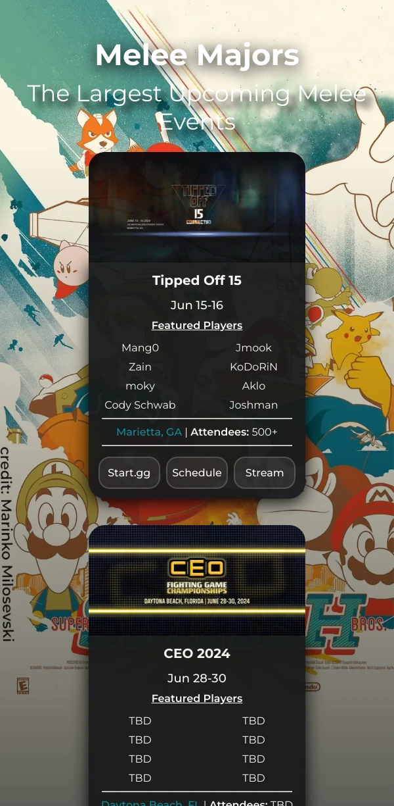
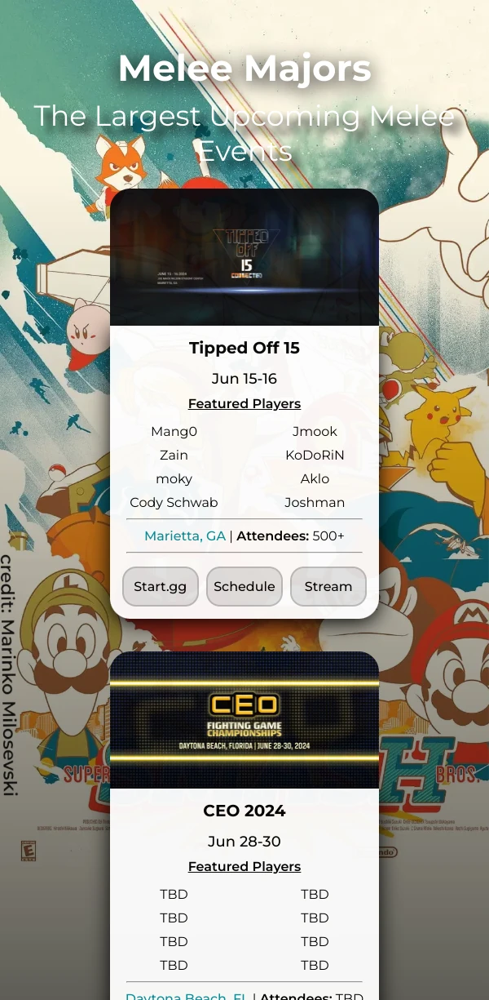

<table>
    <tr>
        <td></td>
        <!-- <td></td> -->
        <!-- <td></td> -->
        <td></td>
    </tr>
</table>

# 🍔 meleebr majors

forked from [meleemajors.gg](https://github.com/jtof-dev/meleemajors.gg), huge thanks to them

## contributing

- are we missing a tournament, or have incorrect information? you can either open an [issue](https://github.com/caioicy/meleebr/issues) with what we are missing, or make a [pull request](https://github.com/caioicy/meleebr/pulls) with an updated [tournaments.json](ssg/src/tournaments.json)
  - for a quick rundown on formatting `tournaments.json`, check out our [contributing documentation](CONTRIBUTING.md)

## backend

- on the backend, we read the `tournaments.json`, and scrape the majority of the information needed about the tournament using [start.gg's api](https://developer.start.gg/)
  - start.gg uses graphql on the backend, and bundle a nice [api explorer](https://developer.start.gg/explorer) that makes it very easy to build queries
  - from there, it just took a lot of data parsing and find-and-replacing variables in a [templateCard.html](ssg/src/html/templateCard.html)

### code flowchart

```
           ┌───────────────┐               ┌─────────────────────┐
           │               │               │                     │
           │ main function ├───► then: ───►│ copy files to site/ │
           │               │               │                     │
           └───────┬───────┘               └─────────────────────┘
                   │
                   │
                   │
                   ▼
       iterate through tournaments

          for each tournament:
                   │
                   │
                   │
                   ▼
        ┌─────────────────────┐
        │                     │
┌──────►│ scrape start.gg api ├───────┐
│       │                     │       │
│       └─────────────────────┘       │
│                                     │
│                                     │
│                                     │
│                                     │
│   ┌────────────────────────────┐    │
│   │                            │    │
└───┤ generate a tournament card │◄───┘
    │                            │
    └──────────────┬─────────────┘
                   │
                   │
                   │
                   ▼
  ┌────────────────────────────────┐
  │                                │
  │ generate calendar subscription │
  │                                │
  └────────────────────────────────┘
```

### running locally

- in `ssg/src`, you can just `cargo run`, but you first need to export your start.gg api key as an environmental variable
- to simplify this, I normally run the backend using this script:

```
export STARTGGAPI=<TOKEN>

cargo run
```

- [getFeaturedPlayers.gql](ssg/src/graphql/getFeaturedPlayers.gql) is generated using [generate_gql.rs](ssg/src/generate_gql.rs), and calling with

```
cargo run -- --generate
```

## hosting

- we use [github pages](https://pages.github.com) to do all the work for us, as long as our website stays static
- to set up, we registered a domain with [aws route 53](https://aws.amazon.com/route53/), verified the domain in `github settings > pages > verified domains`, and added the domain in the pages section of this repo
- after everything was set up, our domain records looked like this:

| type  | domain name                          | content             |
| ----- | ------------------------------------ | ------------------- |
| A     | meleemajors.gg                       | 185.199.108.153     |
| A     | meleemajors.gg                       | 185.199.109.153     |
| A     | meleemajors.gg                       | 185.199.110.153     |
| A     | meleemajors.gg                       | 185.199.111.153     |
| AAAA  | meleemajors.gg                       | 2606:50c0:8000::153 |
| AAAA  | meleemajors.gg                       | 2606:50c0:8001::153 |
| AAAA  | meleemajors.gg                       | 2606:50c0:8002::153 |
| AAAA  | meleemajors.gg                       | 2606:50c0:8003::153 |
| ANAME | meleemajors.gg                       | jtof-dev.github.io  |
| TXT   | `challenge subdomain`.meleemajors.gg | `verification code` |
| CNAME | www.meleemajors.gg                   | jtof-dev.github.io  |

## analytics

- we use [umami](https://umami.is/) for basic analytics, like daily site views and how visitors interact with the website. while this could be useful improving the website, this is mostly because we want to know how much the website is getting used
- these analytics are completely anonymous (at least to us), and just let us dig around with how the website actually gets used
